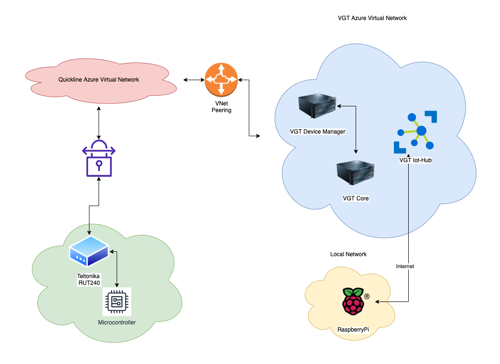

# idb Architektur MiniChallenge Flavio Müller

## Beschreibung

Als MiniChallenge wurden die beiden Geräte in die bestehende Cloud Architektur der VGT AG eingebunden.

## Microcontroller

Dem Microcontroller wurde das 4 Digit Display der Sonar Distanzsensor, sowie eine weiter LED angesteckt.
Dabei zeigt der Display die aktuell gemessene Distanz in cm an.

Zusätzlich läuft auf dem Microcontroller ein Webserver, welcher HTTP Calls entgegen nimmt und die onboard-LED entsprechend ansteuert.

Die Kommunikation erfolgt über ein eigenes Teltonika Modem, welches mit einer SIM Karte ausgestattet ist.
Diese Sim Karte ist Teil eins Virtual Networks in Azure von Quickline.

Dieses VNet hat wiederum ein Peering zum VNet der VGT AG. Damit lassen sich über diverse Server (Device Manager, Core, etc.) Nachrichten an das Device schicken und so die LED steuern.

## Raspberry Pi

Der Raspberry PI ist mit einem Button und einem HDT11 Temperatursensor ausgestattet.
Über das lokale Netzwerk sendet der Rapsberry Pi die Sensorwerte an einen Azure IOT Hub, welcher ebenfalls Teil des VGT VNet ist.

Ausserdem wurde auf dem Raspberry Pi ein Cache hinzugefügt, welcher die Daten speichern würde, falls das Netzwerk nicht verfügbar ist.

Bei einem Recovery des Netzwerks werden die Daten dann mit Timestamp an den IOT Hub gesendet.
